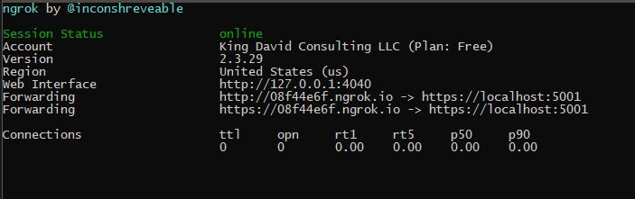
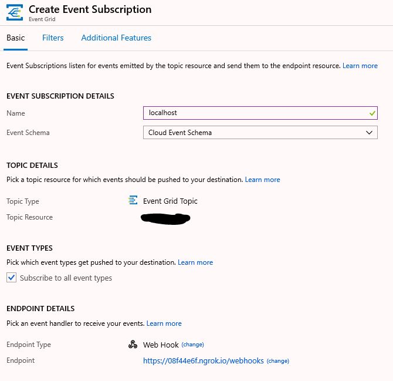

# Bet.AspNetCore.EventGrid solution

The middleware and viewer for Azure Event Grid. 


## Required Azure resources:

1. Azure Event Grid Topic
2. Azure Web App or App Functions


## Usage of the Azure Web App WebHooks

1. Register Event Handlers

```csharp

    services.AddEvenGridWebhooks()
                .AddViewerHubContext()
                .AddWebhook<EmployeeWebhook, EmployeeCreatedEvent>("Group.Employee")
                .AddWebhook<CustomerWebhook, CustomerCreatedEvent>("Group.Employee");

    // enable Azure Grid Event Viewer
    services.AddEventGridViewer();
```

2. Add Middleware

```csharp

   app.UseEventGridWebHooks();

```

3. WebHook implementation example

```csharp

public class CustomerWebhook : IEventGridWebhook<CustomerCreatedEvent>
    {
        private readonly ILogger<CustomerWebhook> _logger;

        public CustomerWebhook(ILogger<CustomerWebhook> logger)
        {
            _logger = logger;
        }

        public Task<EventGridWebHookResult> ProcessEventAsync(CustomerCreatedEvent @event, CancellationToken cancellationToken = default)
        {
            _logger.LogInformation("Executing: {data} ", @event);

            return Task.FromResult<EventGridWebHookResult>(null);
        }
    }
```

4. Azure Event Grid Viewer

To see messages coming in to the middleware.

> https://localhost:5001/events/viewer

## Test Data for Bet.AspNetCore.EventGrid.WebApp project

```json
[
  {
    "topic": "/subscriptions/1234/resourceGroups/test-rs-gp/providers/Microsoft.EventGrid/topics/test-eg-topic",
    "subject": "Bet-Dream-Func",
    "id": "ab8d8ef9-b929-46d8-b205-d72113750da1",
    "eventType": "Group.Employee",
    "eventTime": "2019-04-28T18:51:17.7994409Z",
    "data":{
    	"Id": "12345",
    	"Name": "hello"
    },
    "dataVersion": "2",
    "metadataVersion": "1"
  }
]
```

## Testing Azure Event Grid Webhooks callbacks
What if you want to test the round trip communication locally on your machine. [`ngrok`](https://ngrok.com/?source=kdcllc) to the rescue.

1. Install with `npm i -g ngrok`.
2. Run `Bet.AspNetCore.EventGrid.WebApp` project on port `5001`
3. Run `ngrok http https://localhost:5001`

4. Use the randomly generated URL for EventGrid Webhook. Create Event Subscription



## Reference material

1. [Azure Event Grid Viewer with ASP.NET Core and SignalR](https://madeofstrings.com/2018/03/14/azure-event-grid-viewer-with-asp-net-core-and-signalr/)
2. [Receive events to an HTTP endpoint](https://docs.microsoft.com/en-us/azure/event-grid/receive-events)
3. [Locally debugging an Azure Function triggered by Azure Event Grid](https://blogs.msdn.microsoft.com/brandonh/2017/11/30/locally-debugging-an-azure-function-triggered-by-azure-event-grid/)
