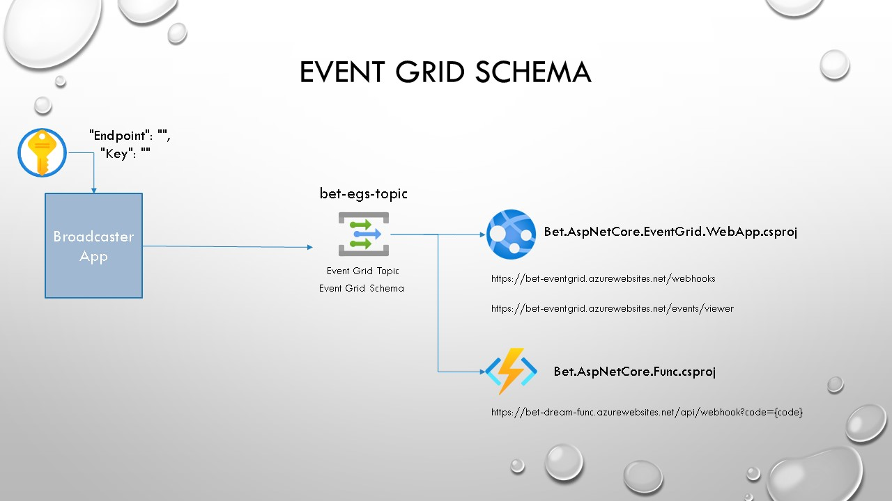

# Bet.AspNetCore.EventGrid Webhooks

The solution includes the following projects:

1. [`Bet.AspNetCore.EventGrid.Abstractions`](./src/Bet.AspNetCore.EventGrid.Abstractions/README.md)

2. [`Bet.AspNetCore.EventGrid`](./src/Bet.AspNetCore.EventGrid/README.md) - the middleware to enable `Webhooks` framework processing.

3. [`Bet.AspNetCore.EventGrid.Viewer`](./src/Bet.AspNetCore.EventGrid.Viewer/README.md) the event grid debug `Viewer` for custom `Webhooks`.

4. [`Bet.AspNetCore.EventGrid.MessageHandlers`](./src/Bet.AspNetCore.EventGrid.MessageHandlers/README.md) - Custom `SAS Delegating Handler` and `HttpClient`

The sample solutions:

1. [`Bet.AspNetCore.EventGrid.WebApp`](./src/Bet.AspNetCore.EventGrid.WebApp/README.md) - Web Application that provides support for custom `Webhooks`.

2. [`Bet.AspNetCore.Func`](./src/Bet.AspNetCore.EventGrid.WebApp/README.md) - Azure Function example.

3. [`Broadcaster`](./src/Broadcaster/README.md) - Worker application to submit events to Azure Event Grid topics.

## Required Azure Resources

1. Two Azure Event Grid Topics (Event Grid and Cloud Event Schema)
2. One Azure Web App or App Functions
3. One Azure App Web Service

## References

- [Azure CLI and Azure Event Grid Topic](./docs/azure-event-grid.md)

- [Debugging Webhooks locally with `Ngrok`](./docs/ngrok-debug-locally.md)

- [Kubernetes Local Cluster testing](./k8s/REAMDE.md)