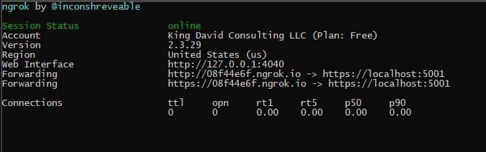

# Debugging Webhooks locally with `Ngrok`

What if you want to test the round trip communication locally on your machine. [`ngrok`](https://ngrok.com/?source=kdcllc) to the rescue.

1. Install via `Node.Js` `npm i -g ngrok` or [https://ngrok.com/download](https://ngrok.com/download).

2. Run `Bet.AspNetCore.EventGrid.WebApp` project on port `5201` over https.

3. Run `ngrok http https://localhost:5201` (to test function locally run `ngrok http -host-header=localhost 7071`)

4. Use the randomly generated URL for EventGrid Webhook. [Create Event Subscription Azure CLI](./azure-event-grid.md) or Web UI:

## Reference

 - [Locally debugging an Azure Function triggered by Azure Event Grid](https://blogs.msdn.microsoft.com/brandonh/2017/11/30/locally-debugging-an-azure-function-triggered-by-azure-event-grid/)

 - [Expose Kubernetes services with ngrok](https://medium.com/@abhishek1987/expose-kubernetes-services-with-ngrok-65280142dab4)
