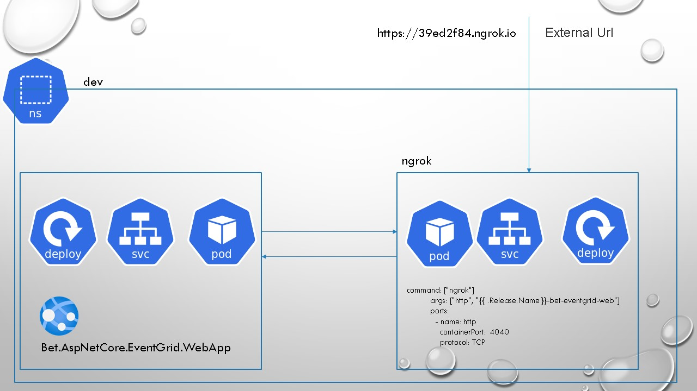

# Kubernetes Local Cluster testing

For more information on Kubernetes local cluster development please refer to [K8.DotNetCore.Workshop](https://github.com/kdcllc/K8.DotNetCore.Workshop).



1. Build docker image

```bash
    docker build -t kdcllc/bet-eventgrid-web-sample:v1 -f "./src/Bet.AspNetCore.EventGrid.WebApp/Dockerfile" .

    # optional check
    docker run -it --rm -p 5200:80 -e EnabledSSL=false kdcllc/bet-eventgrid-web-sample:v1

    # http://localhost:5200/events/viewer

```

2. Install

```bash
    helm install  k8s/bet-eventgrid-web -n beteventgrid

    # uninstall

    helm delete beteventgrid --purge
```

2. Get `Ngrok` port url

```bash
    "http://localhost:$(kubectl get svc beteventgrid-ngrok -o=jsonpath='{.spec.ports[?(@.port==4040)].nodePort}')"
```

## Known issues

- Websockets are not exposed thus `Viewer` will not work.

## References

- [https://github.com/wernight/docker-ngrok](https://github.com/wernight/docker-ngrok)

- [Expose Kubernetes services with ngrok](https://medium.com/@abhishek1987/expose-kubernetes-services-with-ngrok-65280142dab4)