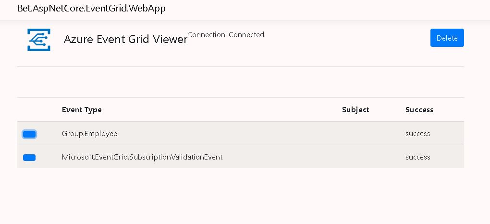

# Bet.AspNetCore.EventGrid.Viewer

[](https://ci.appveyor.com/project/kdcllc/bet-aspnetcore-eventgrid/branch/master)
[](https://www.nuget.org/packages?q=Bet.AspNetCore.EventGrid.Viewer)
[](https://www.myget.org/F/kdcllc/api/v2)

Add the following to the project

```bash
    dotnet add package Bet.AspNetCore.EventGrid.Viewer
```

## Enable the Viewer

If the webhooks are hosted over IIS webserver make sure that `Websokets` are enabled.

Add the following in `Startup.cs`

```csharp
    public void ConfigureServices(IServiceCollection services)
    {
        var hooksBuilder = services.AddEventGridWebhooks();
        hooksBuilder..AddViewerSignalRHubContext();
    }

    public void Configure(IApplicationBuilder app, IWebHostEnvironment env)
    {
        app.UseEventGridWebHooks();
    }
```

## Debug Locally

The viewer is accessible during local development at [https://localhost:5201/events/viewer](https://localhost:5201/events/viewer).

[Enable `Ngrok` for exposing to the internet](../../docs/ngrok-debug-locally.md)

By enabling this library, real-time support for troubleshooting of the events as they coming is possible, here is the screenshot of the UI:



## Known issues

1. The viewer's web socket connection errors out...you will see an error in the browser's debug console. If that happens, refresh the page.
2. Sometimes events show up many seconds later.

## References

- [Azure Event Grid Viewer with ASP.NET Core and SignalR](https://madeofstrings.com/2018/03/14/azure-event-grid-viewer-with-asp-net-core-and-signalr/)